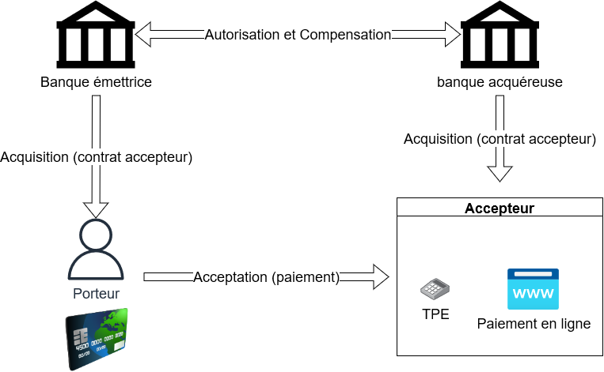

# Introduction

Je souhaite que la Polynésie Française se modernise, les moyens de paiement sont un des axes d'amélioration où je peux aider. Dans ce but, je pense créer une série d'articles et de tutoriels sur les moyens de paiement, et plus particulièrement sur Payzen By OSB, à commencer par cet article.

Update 12/05/2022: suite à quelques feedback, je me rend compte que cet article est à destination des développeurs de site de e-shopping, des commerçants, de mes confrères monéticiens. Cet article sera complexe à lire si vous n'avez jamais travaillé avec un TPE, avec une plateforme de paiement, avec des cartes bancaires.

**Disclaimer**: Au moment où j'écris cet article, je travaille à l'Océanienne des Services Bancaires (OSB), mes articles seront orientés vers les solutions d'OSB car ce sont celles avec lesquelles je suis le plus familier. Ces articles ne sont pas sponsorisés par OSB, et j'encourage les gens à faire des tutoriels pour les solutions des autres fournisseurs de solutions de paiement.

# Les différents types de carte

En Polynésie Française, il est possible de payer avec plusieurs types de cartes.

- Carte Bancaire (anciennement Carte Bleue, co-brandées ou non de Visa ou Mastercard),
- American Express (AMEX),
- Cartes privatives (Socredo Verte / Gold, Banque de Polynésie Hoa, CCP de Fare Rata, Carte Tiare de la Banque de Tahiti),
- Union Pay International (UPI),
- Discover,
- Japan Credit Bureau (JCB)

Les 3 derniers types de cartes sont surtout utilisés par les touristes.

***Les cartes privatives composent la majorité des cartes détenues par les habitants de la Polynésie Française.***

# Pourquoi autant de personnes ont une carte privative ?

Les cartes privatives sont proposées par les différentes banques de la place (à l'exception d'OFINA qui émet exclusivement les cartes AMEX). Il s'agit des banques Socredo, Banque de Tahiti, Banque de Polynésie, et Fare Rata.

Les cartes privatives sont soumises à des réglementations et des frais moins coûteux que les cartes internationales.

En outre, elles sont uniquement régulées par les banques de la place, contrairement aux cartes bancaires internationales, qui sont non seulement régulées par les banques de la place, mais aussi par les réseaux internationaux (CB, Visa, Mastercard, Union Pay, etc.).

***C'est en partie à cause de ces réglementations et frais moins coûteux que les clients des banques doivent remplir moins de conditions pour avoir une carte locale. C'est pour cela que les cartes privatives sont plus répandues sur le territoire.***

Notes:

Les réseaux peuvent décider d'appliquer des amendes voire de désactiver le flux vers un acteur monétaire (banque, processeur de paiement, etc.) si celui-ci ne respecte pas la réglementation. Cette réglementation est mise à jour régulièrement.

Pour les cartes privatives, ce sont les banques de la place qui imposent leur réglementation, par abus de langage, on parle aussi de réseau privatif pour désigner l'ensemble de ces banques.

Ces réglementations sont suivies par les banques centrales des pays, par exemple l'IEOM en Polynésie Française. 

J'ai inclus la carte Tiare de la Banque de Tahiti dans les cartes privatives car elle a les mêmes limitations géographiques que celles-ci, mais il s'agit bien d'une CB, donc elle est soumise aux réglementations CB.

Les cartes Socredo privatives sont maintenant co-brandées UPI, mais il y a bien 2 applications dans la carte, sur le territoire, c'est l'application privative qui est utilisée, à l'international, c'est l'application UPI qui est utilisée.

# Fonctionnement des transactions

Le schéma à 4 coins est l'un des schémas de référence de la monétique. Il explique les entités qui entrent en jeu dans une transaction.

La banque émettrice émet la carte et la fournit au porteur.

La banque acquéreuse fournit un contrat accepteur au commerçant, afin que celui-ci puisse encaisser les paiements avec les cartes, moyennant une commission, en plus des services annexes autour de l'encaissement (exemple: relevé TPE). Les TPE et solutions de paiement en ligne sont des services d'encaissement.

Un système d'acceptation est un logiciel ou un ensemble de logiciels, qui permet d'encaisser une carte bancaire, par exemple les TPE et les plateformes de paiement en ligne.

Il existe 2 modes de fonctionnement pour le déroulement d'un paiement:

- le mode single message
- le mode dual message

Lorsque vous payez avec votre carte, vous réalisez une transaction. Si toutes les règles de gestion sont validées, la transaction est autorisée.

En single message, la transaction autorisée est directement transformée en mouvement financier, i.e. un enregistrement est créé chez la banque acquéreuse qui dit "M. Client doit 1000 XPF à M. Commerçant".

En dual message, la transaction est enregistrée sur le TPE, ou sur la plateforme de paiement, puis, tous les jours à une certaine heure, l'ensemble des transactions de la journée sont envoyées à la banque acquéreuse sous forme de mouvement financier.

En Polynésie Française, le mode dual message est le plus répandu, c'est d'ailleurs pour ça que l'on vous demande de ne pas débrancher votre TPE, votre internet, votre réseau électrique.

# Les cartes et les systèmes d'acceptation

Pour qu'un système d'acceptation puisse encaisser une carte, elle doit reconnaître la carte.

Pour reconnaître une carte, on utilise le BIN, qui sont les *N* premiers chiffres du numéro de la carte, *N* étant défini par le réseau.

De plus, seule une application spécifique à ce réseau peut reconnaître cette carte. Par exemple, pour une transaction avec une carte AMEX sur un TPE, c'est uniquement une application TPE AMEX qui pourra la reconnaître, mais ***seulement si la carte fait partie d'une plage de BIN acceptée par l'application***.

Note: Dans un TPE, il peut y avoir plusieurs applications, quand une carte est insérée, le TPE demande à chaque application "Peux-tu accepter cette carte?".

De la même manière, pour une plateforme de paiement en ligne, celle-ci ne pourra accepter que des cartes qui font partie de ses plages de BIN déclarées.

# Zoom sur le paiement en ligne en Polynésie Française

Comme énoncé précédemment, les cartes privatives sont majoritaires en Polynésie Française, et elles ne sont pas reconnues à l'étranger (sauf pour les cartes Socredo co-brandées UPI, comme cité précédemment) car les BIN privatifs ne sont pas déclarés dans le monde.

C'est pour cela qu'on ne peut pas payer avec une carte privative sur la plupart des plateformes de paiement en ligne (Paypal, Stripe, etc.).
 
Pour remédier à ce problème, OSB propose Payzen, qui est actuellement la solution la plus connue qui accepte les cartes privatives. La Banque de Tahiti quant à elle vient de lancer SystemPay, un produit concurrent.

À mon avis, à l'heure actuelle, c'est vers ces solutions que je conseille les commerçants d'aller, car ***il serait dommage de se priver des cartes privatives, alors qu'elles sont plus nombreuses.***

Notes:

Les 2 solutions sont en réalité basées sur les solutions Payzen et SystemPay de Lyra, société située en France. Certains d'entre vous ont d'ailleurs peut-être déjà été confus en recherchant de la documentation sur ces solutions et se sont perdus entre la documentation Payzen d'OSB, la documentation Payzen de Lyra, la documentation SystemPay de la Banque de Tahiti, et la documentation SystemPay de Lyra.

***Je vous conseille de vous focaliser sur les documentations locales, et ensuite de compléter avec les documentations de Lyra.***

# Conclusion

En Polynésie Française, la plus grande part des cartes bancaires sont des cartes privatives, pour des raisons économiques et réglementaires.

Le fonctionnement même des systèmes d'acceptation impose quels types de cartes ils peuvent accepter, de ce fait, un commerçant local qui cherche une solution de paiement en ligne devrait se tourner vers les plateformes qui acceptent les cartes privatives.

C'est à partir de ce raisonnement que dans les articles suivants, je présenterai comment implémenter Payzen By OSB sur une application web fullstack.

Si vous utilisez un CMS du style Odoo ou Prestashop, il existe des modules déjà tout faits pour intégrer Payzen dans votre site. Je ne parlerai pas des CMS dans cette série d'articles.